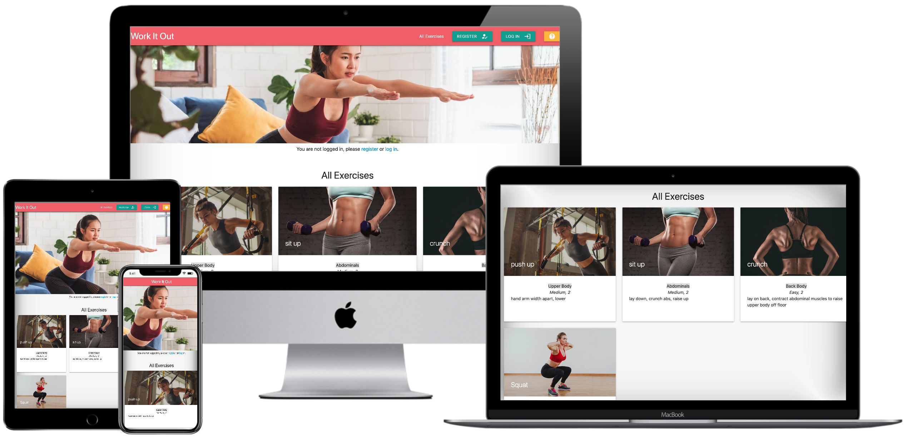

# Work It Out

It's no secret that a key to a healthy life is to be active, and for many, the hardest part is figuring out where to start. Work It Out allows you to put your own workout together in blocks, from a database of other users' favourite exercises.

If you would like to get in touch about this project, head over to my github profile to get the details. Thank you for visiting.

## table of contents here ****************

## User Experience

### Goals

The primary goal of this project is to allow users to create, view, store, arrange, and share workouts. Workouts are submitted as individual exercises, that are categorised in various ways to make putting a complete workout together easy - hopfully making getting started that little bit easier.

### User Goals

* Create their own custom made exercises.
* Put a body target, name, instruction and est time & difficulty for each exercise.
* Edit any field in previously saved exercises.
* Delete any field in previously saved exercises.
* Put together workouts made from adding any of all the submitted individual exercises from the entire user base.
* Have ones own library of submitted data and workout compliations that is editable from a profile page.
* View the site on any device without compromise on features, including smart phones, tablets and desktop web browsers.
* Have the ability to message the developer directly.
* Find tips on how to make a workout and what kind of exercises one wants to do.
* Easy to use user interface and fluid user experience.

### User Stories

* As a user, I would like to be able to register on the website and have a tailored experience.
* As a user, I want to be able to log in after registration and see my account and previously submitted exercise data.
* As a user, I would like to be able to name my own exercises.
* As a user, I would like to be able to make my own exercise instruction.
* As a user, I would like to provide details for other people about my exercise like est time and percived difficulty.
* As a user, I would like to be able to delete exercises I have made.
* As a user, I would like to add exercises from a library into a workout for my day.
* As a user, I want to return to the site and still have my exercises available.
* As a user, I want a free workout service.
* As a user, I want to be able to send messages to the developer to report bugs or problems with the site with a view to getting them fixed.

### Developer Goals

* Collect a database of exercises.
* Open communication with users via in-site email.
* Provide a service to users that want to exercise with their own workout plan.

### User Requirements/Expectations

#### **Requirements:**

* Visually appealing website and easy/familiar navigation.
* A safe and sensible collection and display of users data.
* Easy to use forms for exercise data input.
* Easy to use complete workout builder.

#### **Expectations:**

* Tips for new users.
* Tips for new-comers to exercise / how to put together a decent workout.
* Profile page with history of workouts.
* Ability to edit listings.

### Design Choices

#### Colours

This project uses bright and vibrant colours that match an active approach to life. Bright oranges for nav the bar and teals for buttons show information to users without distraction.

* #009688 - for informational elements and buttons.
* #ee6e73 - for nav bar and footer.
* #F44336 - red for floating action button to add exercises to workout, but to display that exercise currently does not exists in user workout.
* #4CAF50 - green for floating action button to remove exercise from workout, but to display that exercise currently exists in user workout.

##### Shadows and Structure

Card type displays are used for each exercise to contain the information as fluuidly as possible with floating action buttons to display wether an exercise is in the users workout list already.

Each card makes use of Materialize's shadow effect for greater visibility of information.

#### Fonts

The font used is the default materialze font throughout the project, [Roboto](https://fonts.google.com/?query=roboto).

#### Icons

I used the built in [Materialize Icon](https://materializecss.com/icons.html) set for this project. Icons are used throughout the project to further simplify the user exeperience. For example the register icon is a bust silhouette with a tick.

#### Images

Images were sourced from the internet.

The hero image was sourced from [Womens Health Mag](https://www.womenshealthmag.com/).

The icons for the body target images were sourced from [Muscle and Fitness](https://www.muscleandfitness.com/) and resized to fix better in a grid layout.

## Wireframes and Flowcharts

I made wireframes for this project on Balsamiq Wireframes for mobile / tablet / desktop. It was a huge help in quickly getting the visual structure and figuring out the most simple to use user experience. [Links to the wireframes are here](https://github.com/lornebb/Building-Block-Body/tree/main/Wireframes).

After the wireframes were done, a quick visual mock up of the landing page using Material UI was done using [Adobe XD](https://www.adobe.com/products/xd.html) with a Material Ui Kit expansion without changing the colours.

### Account Creation Flowchart

Since this was my first attempt at using databases in web development, I created a flowchart using [Goodnotes](https://www.goodnotes.com/) for the user experience to access a log in page. Which helped to further elaborate and proove my UI concepts. [This flowchart sketch is here](https://github.com/lornebb/Building-Block-Body/blob/main/wireframes/flowchart/flowchart-userarrival.jpg).

### Database Design

#### Data Storage Types

* ObjectID
* String
* Array

##### Body Target_Category Collection

**Name** |**Key** | **Value**
:-:|:-:|:-:
_id | _id | ObjectId
Body Target | body_target | String

##### Users Collection

**Name** | **Key** | **Value**
:-:|:-:|:-:
User ID | _id | Object_Id
User | username | String
Password | password | String
Workout | workout | Array

##### Exercises Collection

**Name** | **Key** | **Value**
:-:|:-:|:-:
Exercise Id | _id | ObjectId
Exercise Name | exercise_name | String
Body Target | body_target | String
Estimate Time | est_time | String
Difficulty | difficulty | String
Instruction | instruction | String
User | user | String

## Features

### Existing Features

Feature 1 - allows users X to achieve Y, by having them fill out Z

* Register - allows users to register a username and password by having them fill out a registration form.

* Log in - allows users to use their previous username and password to access their profile again.

* Profile - Once the user is logged in, the user can then **create, read, edit or delete** their items on the database.

* Workout - allows user to add any exercise in the database to their own workout list. Also has function to remove a workout from a list.

* Contact - allows users to contact the developer directly, using their username.

### Features Left to Implement

* More intricate submissions from users that can then be searchable and scalable.

* An 'in workout' mode, where, once a user has selected their workout, can work through it with live timers, rest timers, and completed boxes.

* Progression logging - where a user can track a history of what exercises have been completed and how they did. Eg. rep progression, speed progression etc.

* Video integration of exercise into application. So each exercise logged can also include an inline player or uploaded video of the workout. Will most likely also include review process here for user security.

* Video integration to be saved privately for users tracking or filming their own progression for reference later on.

* More intricate muscle groups for body target focus, probably with a sub-group or 'also targeted' field.

* Use extra data in exercises to create instant filters on All Exercises page.

* Add ability for injury consideration for what exercises are not reccomended for users ith injuries.

* Change the log in method using [flask @login_required](https://flask-login.readthedocs.io/en/latest/#flask_login.login_required)

* Create testing scripts for site errors with [Cypress](https://www.cypress.io/)

* Abilty to re-organise workout order.

## Technologies Used

### Languages

* [HTML](https://developer.mozilla.org/en-US/docs/Web/HTML)

* [CSS](https://developer.mozilla.org/en-US/docs/Web/CSS)

* [JavaScript](https://www.w3schools.com/js/)

* [JSON](https://www.json.org/json-en.html)

* [Python](https://www.python.org/)

### Libraries / Frameworks

* [Materialize](https://material-ui.com/)

* [jQuery](https://jquery.com/)

### Tools

* [Flask](https://flask.palletsprojects.com/)

* [Jinja](https://jinja.palletsprojects.com)

* [Werkzeug](https://werkzeug.palletsprojects.com/en/1.0.x/)

* [Git](https://git-scm.com/)

* [MongoDB Atlas](https://www.mongodb.com/cloud/atlas)

* [PyMongo](https://pymongo.readthedocs.io/en/stable/)

* [SASS/SCSS](https://sass-lang.com/)

## Testing

### Register

> User Story - As a user, I would like to be able to register on the website and have a tailored experience.

* **Plan**

The plan is to create a page that, upon arrival, users can choose a username and password and create their own exercises and workout in the database. I need to be able to store their data safely in the database and create the ability to recall that data when they log back in.

* **Implimentation**

I created a registration script that takes the information from the registration form and creates a user in the database using that text. The passwords sent need to not be in clear text, so they are salted using Werkzeug and passed to the database. I have no ability to see user passwords. Once this user is created in the database, they are redirected to their new profile page, which will return the feedback to the user that they have not submitted any workouts yet, and if they checked their workout page, that would also be empty. Both pages will show a "get started"-type box with links to the Add Exercise or All Exercises pages respectively so they can get started with building their profile.

* **Test**

1. Register on site:
    1. Select the "Register" option in the navbar.
    2. Try to submit the empty form and verify that an error message about the required fields appears.
    3. Try to submit the form with less than 5 alphanumeric characters as the username.
    4. Try to submit the form with less than 5 alphanumeric chatacters as the password.
    5. Try to submit the form with all inputs valid and verify that a success message appears and you are redirected to the profile page.
    6. Profile page should greet you by your username and show no exercises. A call to action button to add yoru first exercise should appear.

2. It is also possible at this point to check that no one else is sharing that username and it is not possible to register with the same username twice:
    1. Select the Logout button in the nav bar.
    2. Select Register in the nav bar.
    3. Attempt to register with same credentials again.
    4. Message should show that the username already exists.

### Login

> As a user, I want to be able to log in after registration and see my account and previously submitted exercise data.

* **Plan**

Once a user has registered a username and password in the database, I needed to make a way for the user to log back in to access that data. Using a new script that would take the user input on the log in form, check it against the data base to verify, then create a session cookie.

* **Implimentation**

I needed to make it as easy as possible to log in, so on site arrival, on the home page, right next to register is a link to Log In on the navbar. This opens a form to log in, that, on submit, will send the data to be checked against the database and if correct will create the session cookie and return the user to their profile page, loading their exercise and workout information along with it.

* **Test**

1. Log in test:
    1. Select "Log In" in the mavbar.
    2. Try to submit the form with an incorrect username and verify that an error message appears saying that the details are incorrect.
    3. Try to submit the form with an incorrect password and verify that an error message appears saying that the details are incorrect.
    4. Try to submit the form with all correct details and verify that you are redirected to you prfoile page.

### Create Exercise

> As a user, I would like to be able to name my own exercises.
> As a user, I would like to be able to make my own exercise instruction.
> As a user, I would like to provide details for other people about my exercise like estimated time and perceived difficulty.

* **Plan**

Now that I have users with a profile, I need to give them the opportunity to add exercises to the database following the key requirements, while also giving an opportunity to create a rich range of data to give users an opportunity to create varied exercises.

* **Implimentation**

On the Add New Exercises page I wanted to create some ability to trunkate the range of exercises so it doesnt get too unwiedly - that is why there is a Main Body Target list. I made four main body targets that broadly cover all exercises. Originally I wanted an optional secondary body target but it created too many problems with the sorting. So instead the Body Target dropdown is populated by the range of body targets in the database.

The form is quite simple after that - the Exercise Name is limited to 20 characters max, and 5 minimum, to keep the names as concise as possible. Intstruction is limited to 70 charcters and Estimate Time is limited to one number between 0 and 9. I used a Materialize data counter on those fields so when a user clicks on them to fill them in, a charcter counter appears under the field for visual feedback of the resitrictions. Difficulty is a dropdown of three options and is not required before submission, I have set a default for this value of medium, the ability to change this is available though. I also want to ensure the user that they are on their profile and adding exercises to their exercise collection by greeting them with their name.

* **Test**

1. Add a new exercise:
    1. Once logged in, select "Add New Exercise" from your profile page
        1. If you have previous exercises on your profile check verify that the "Add a new exercise box is there.
        2. If you do not have any exercises on your profile, verify that the "Add a new exerices box is there.
    2. On add exercise page, verify that you are greeted by your username in the page title and have an empty form infront of you.
        1. Try to submit form without adding any data and ensure that you are greeted with a warning message abotu required fields.
    3. Choose a main body target from the pre selected body targets.
        1. Try to submit form with only a body target and ensure that you are stopped with warning message about required fields.
    4. Type an exercise name that is less than 5 characters long and try to submit, ensure that you are stopped with warning message about length of field.
    5. Try to type exercise name longer than 20 characters, ensure that you are stopped at the 20th character.
        1. Try to submit form again and ensure that you are stopped with message about required fields.
    6. Enter an instruction of less than 10 charcters in the intruction field and try to submit to ensure that you are met with messages about reuired length.
    7. Try to type an exercise instruction longer than 70 characters, ensure that you are stopped at the 70th character.
        1. Try to submit form again and ensure that you are stopped with message about required estimate time field.
    8. Try to type more than one number in the est time field and ensure that you are stopped from doing so.
    9. Change difficulty setting if you wish to, or leave it at medium.
    10. Submit exercise to database and ensure that you are brought back to your profile with the new exercise in the database.

### Edit Exercise

> As a user, I would like to be able to edit exercises I have made after they have been submitted.

* **Plan**

I needed to now create a way of users being to edit their exercises once they had been submitted. On the profile page it needed to only show exercises that the user had made, and if they had made them, show them options to edit their exercise. All while maintaining a visually usable interface to do so.

* **Implimentation**

On the profile page there is a script for showing user exercises that cycles through the database looking for matches of session cookie user name and the user field in the exercises. If it matches then that exercises is added to those shown on the page. From there I can show an edit button that will send the exercise object id to the edit page along with the rest of the data so the user can edit it.

On the edit page, the data from the exercise will be present and available to edit on the page. Finalising in an Edit Exercise button that resubmits that back to the database to update it.

* **Test**

1. Edit exercise:
    1. From profile page check exercises displayed to ensure that no exercises not made by the logged in user are present.
        1. Only these exercises will have an edit button.
            1. (Same applies for All Exercises page)
    2. On your chosen exercise that you have submitted, select the edit button. Ensure that you are redirected to an edit page, that has all the data from the excerise populating the respective fields.
        1. Click Edit Exercise button at the bottom to ensure that all fields are still filled in and exercise can sucessfully be edited.
        2. ensure that you are redirected back to the profile page then repeat step 1 and 2 without the amendment.
    3. Remove all text from exercise name and try to submit, ensure that you are stopped with a required field message.
        1. fill an exercise name back in greater than 5 characters.
    4. Remove all text from exercise instruction field and try to submit, ensure that you are stopped with a required message.
    5. Change est time and difficulty if desired.
    6. Click on edit exercise button and ensure that you are redirected back to profile page with your updated exercise visible.

### Delete Exercise

> As a user, I would like to be able to delete exercises I have made.

* **Plan**

I needed to now create a way of users being to delete their exercises once they had been submitted. On the profile page it needed to only show exercises that the user had made, and if they had made them, show them options to delete their exercise. All while maintaining a visually usable interface to do so.

* **Implimentation**

On the profile page there is a script for showing user exercises that cycles through the database looking for matches of session cookie user name and the user field in the exercises. If it matches then that exercises is added to those shown on the page. From there I can show an delete button that will use the exercise object id to delete the exercise from the databse then redirect users back to profile.

* **Test**

1. Delete an exercise:
    1. From profile page check exercises displayed to ensure that no exercises not made by the logged in user are present.
        1. Only these exercises will have a delete button.
            1. (Same applies for All Exercises page)
    2. On your chosen exercise that you have submitted, select the delete button. Ensure that you are redirected to your profile page and that the exercise no longer exists. Also ensure that you have a message telling you that the exercise has been deleted.

### Add to Workout

> As a user, I would like to add exercises from a library into a workout for my day.

* **Plan**

A feature I was very keen on making was the workout feature, although it prooved time and time again to be more difficult to impliment than I had first thought. I want to allow a user to add an exercise that they like or want to add to a 'workout' to a new page where they can focus on only those exercises.

* **Implimentation**

This was easier to do on the Profile page than on the All Exercises page as I needed to only allow logged in users to add exercises to their workout, and more so, display that it was in their workoout visually by changing the add button to a remove button. I opted for plus icons and tick icons along with red and green colouring respectively and Materialize's toast info pop out feature.

The logic is that when there is a session cookie, it will check that users workoout array for exercise object ids and only display green ticks to those exercises that are found in the array, otherwise, show a red plus button. If there is no session cookie, then it will not display a button at all.

This actually caused a massive bug that caused a 500 error - when an exercise was deleted that was still in a workout, none of the logic worked. I fixed this by adding extra logic that checks on delete if it is in any users array then deletes from there too.

* **Test**

### Contact

> As a user, I want to be able to send messages to the developer to report bugs or problems with the site with a view to getting them fixed.

* **Plan**

* **Implimentation**

* **Test**

In addition, you should mention in this section how your project looks and works on different browsers and screen sizes.

You should also mention in this section any interesting bugs or problems you discovered during your testing, even if you haven't addressed them yet.

If this section grows too long, you may want to split it off into a separate file and link to it from here.

## Deployment

This section should describe the process you went through to deploy the project to a hosting platform (e.g. GitHub Pages or Heroku).

In particular, you should provide all details of the differences between the deployed version and the development version, if any, including:
- Different values for environment variables (Heroku Config Vars)?
- Different configuration files?
- Separate git branch?

In addition, if it is not obvious, you should also describe how to run your code locally.

## Credits

### Content
- The text for section Y was copied from the [Wikipedia article Z](https://en.wikipedia.org/wiki/Z)

### Media
- The photos used in this site were obtained from ...

### Acknowledgements

- I received inspiration for this project from X